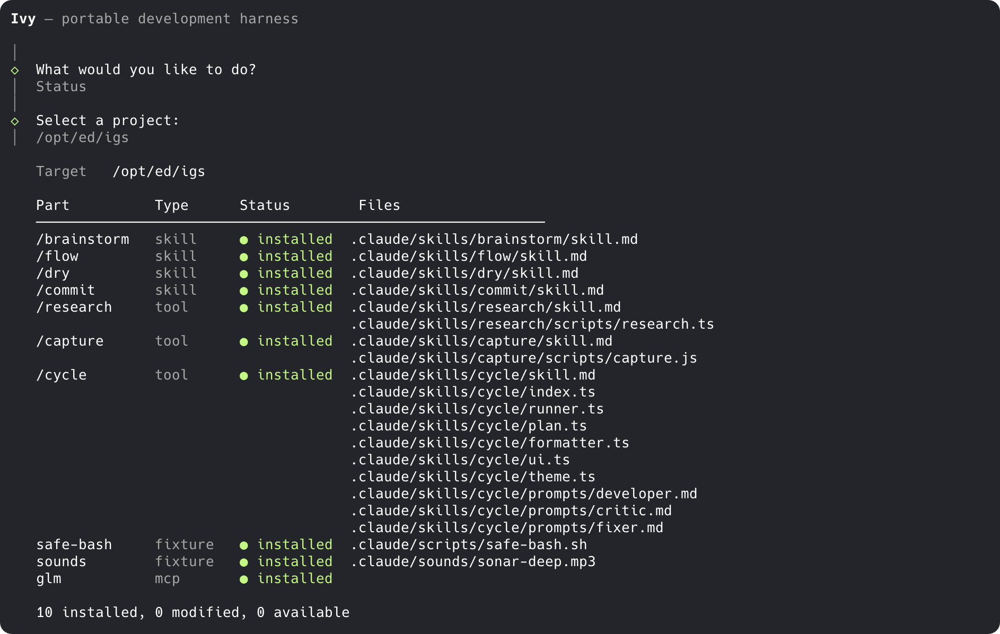

# Ivy

**Simple portable development harness for Claude Code.**
       
Manages a curated extendable set of skills, tools, fixtures, and MCP servers. Installs them into any Claude Code project with one command. Uninstalls cleanly. Update all connected projects by updating ivy.



## How it works

Ivy **symlinks** its `parts` into your project's `.claude/` directory. This means:

- Updating ivy instantly updates all connected projects
- No copied files to drift out of sync
- Clean uninstallation removes only what ivy added
- Manifest with SHA-256 hashes detects local modifications

## Parts

Curated list of parts to start with:

| Part          | Type    | Model  | Description                                       |
|---------------|---------|--------|---------------------------------------------------|
| `/brainstorm` | skill   | opus   | Interactive planning, generates plan files        |
| `/dry`        | skill   | opus   | Code critic, review uncommitted changes           |
| `/flow`       | skill   | sonnet | Research and visualize system flows               |
| `/commit`     | skill   | sonnet | Structured git commits                            |
| `/cycle`      | tool    | —      | Developer-critic-fixer ralph loop over plan files |
| `/research`   | tool    | —      | Deep web research via Grok AI                     |
| `/capture`    | tool    | —      | Screenshot capture via Playwright                 |
| `safe-bash`   | fixture | —      | Block destructive bash commands                   |
| `sounds`      | fixture | —      | Sonar notification on Claude session end          |
| `glm`         | mcp     | —      | GLM model proxy (z.ai)                            |

### Part types

| Type        | Prefix | What it is                                                                |
|-------------|--------|---------------------------------------------------------------------------|
| **skill**   | `/`    | Single `skill.md` with model directive, invoked as `/name` in Claude Code |
| **tool**    | `/`    | Skill with supporting scripts or runtime, invoked as `/name`              |
| **fixture** | —      | Project configuration: hooks, scripts, assets (not a command)             |
| **mcp**     | —      | MCP server entry injected into `.mcp.json`                                |

## Setup

**Prerequisites**: [Bun](https://bun.sh) runtime.

```bash
git clone git@github.com:jdanilov/ivy.git
cd ivy
bun install
```

## Usage

```bash
# Interactive mode — pick command and project
bun src/cli.ts

# Direct commands
bun src/cli.ts install /path/to/project
bun src/cli.ts uninstall /path/to/project
bun src/cli.ts status /path/to/project
bun src/cli.ts cycle /path/to/project           # Runs cycle ralph loop
```

## Workflow: brainstorm + cycle

The `/brainstorm` and `/cycle` parts work together as a plan-and-execute workflow:

1. **Plan** — inside Claude Code, run `/brainstorm add dark mode support`. Opus asks clarifying questions, then generates a plan file at `docs/plans/dark-mode-support.md` with tasks and acceptance criteria.

2. **Execute** — in your terminal, run cycle from the project directory:
   ```bash
   bun .claude/skills/cycle/index.ts dark-mode-support
   ```
   Cycle picks up the plan and runs an autonomous loop: Developer implements tasks, Critic reviews changes, Fixer addresses findings, Committer creates structured commits. Repeats until all tasks are done.

3. **Iterate** — if the Developer needs input, it adds "Ask User" items to the plan. Cycle pauses and prompts you for answers before continuing.

## Creating a new skill

1. Create `parts/skills/<name>/skill.md`:
   ```markdown
   ---
   name: my-skill
   model: sonnet
   description: What this skill does
   ---

   # My Skill

   Your prompt here. $ARGUMENTS contains what the user typed after /my-skill.
   ```

2. Register in `src/core/registry.ts`:
   ```typescript
   {
     name: 'my-skill',
     type: 'skill',
     description: 'what it does (model)',
     default: true,
     files: [
       { source: 'parts/skills/my-skill/skill.md', target: '.claude/skills/my-skill/skill.md' },
     ],
   },
   ```

3. Run `ivy install` on your project to symlink the new skill.

## Environment variables

Some parts require API keys. Ivy checks both `process.env` and the target project's `.env` file.

| Part        | Variable      | Where to get             |
|-------------|---------------|--------------------------|
| `/research` | `XAI_API_KEY` | https://console.x.ai     |
| `glm`       | `GLM_API_KEY` | https://open.bigmodel.cn |

## License

MIT
