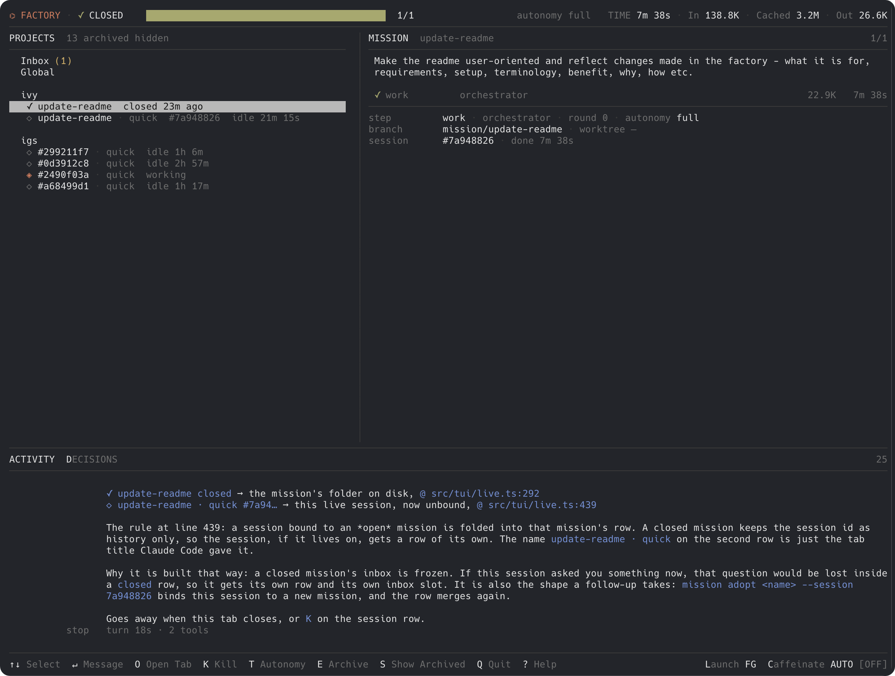

# ⌬ Factory

**Minimalistic portable agent harness for Claude Code.**

- Factory manages an extendable set of `skills`, `tools`, `hooks` and `MCPs` for a fast, practical
  SDLC with Claude Code.
- One command installs them into any project, one updates, one removes.
- Parts are copied in, so a project stands on its own; `update --all` carries a Factory change to
  every connected project.



## Setup

**Prerequisites**: [Bun](https://bun.sh).

```bash
git clone git@github.com:jdanilov/ivy.git factory && cd factory && bun install
```

```bash
bun start                                # interactive: pick a command and a project
bun src/cli.ts <command> [args]          # or run a command directly
```

Parts are copied into the project's `.claude/`, so it can be committed and read on a machine without
the Factory. `.claude/.factory-manifest.json` records SHA-256 hashes, so local modifications are
visible, `update` restores them and uninstall removes only what the Factory added. Recent projects
live in `~/.factory/projects`.

## Commands

`install`, `uninstall`, `status` and `update` take a project path; without one they act on the current directory when it is a registered project, and open a picker otherwise.
Everything else acts on the checkout you are standing in and never prompts.

| Command                                        | Purpose                                                                     |
|------------------------------------------------|-----------------------------------------------------------------------------|
| `factory`                                      | Open Mission Control: every project, mission, session and open gate         |
| `factory menu`                                 | The interactive picker: a command, then a project                           |
| `factory --fixture`, `factory --frames <dir>`  | Draw the demo snapshot; write the screen as text and exit, with no terminal |
| `install [project]`                            | Pick parts and copy them into the project's `.claude/`                      |
| `install [project] --parts a,b`                | Install exactly those parts and what they require, no menu, no confirm      |
| `uninstall [project]`                          | Pick installed parts and take their files, hooks and settings back out      |
| `status [project]`                             | What is installed, modified, in conflict or skipped, plus open missions     |
| `update [project] [--skip a,b]`                | Rewrite the copies, add defaults, drop retired ones, leave `--skip` alone   |
| `update --all`                                 | Every registered project, then `~/.claude/`, in one run                     |
| `install\|uninstall\|status\|update --global`  | The same four over `~/.claude/`, on the parts marked `scope: global`        |
| `mission new <name> [--autonomy L]`            | Create the folder, the `intent` workflow copy, `state.json`, branch, claim  |
| `mission new <name> --stub \| --quick`         | Intent skeleton with no branch, or the one-step `quick` workflow            |
| `mission shape <preset> [--autonomy L]`        | Append a preset's steps behind `intent`, once, after the intent gate        |
| `mission autonomy full\|partial\|none [name]`  | Move the dial that decides which decisions wait on the human                |
| `mission open [name]`                          | Spawn the session in a Warp tab; a stub is promoted, a bound one refused    |
| `mission list [--all]`                         | Every mission across `~/.factory/projects`, stubs last                      |
| `mission status [name]`                        | The workflow one step per row, with gates, round and session liveness       |
| `mission adopt <name> --session <id>`          | Bind a running Claude Code session to the mission                           |
| `mission resume [name]`                        | Check the branch back out and print the current step and open gates         |
| `mission close [name] [--keep-branch]`         | Merge the branch, mark it closed, clear the claim, delete the branch        |
| `mission archive\|unarchive <name>`            | Move a closed mission's folder into `.factory/archive/`, or back            |
| `step start\|done\|skip <step>`                | Move a step to running, done or skipped                                     |
| `step add <step> --after X --reason R`         | Insert a step the workflow does not have                                    |
| `step loop <step>`                             | Record a round and send the mission back to the step's loop target          |
| `gate open <step> --file F`                    | Put a gate's content up for an answer                                       |
| `gate answer <step> accept\|amend\|reject`     | Answer a gate once; a conflicting second answer is refused                  |
| `gate list`                                    | Every open gate across projects                                             |
| `decision add "<s>" --confidence L`            | File a fork with its reason; the mission's autonomy decides if it waits     |
| `decision answer <id> accept\|overrule`        | Answer once; a conflicting second answer is refused                         |
| `decision list [--waiting]`                    | The mission's decisions, or only the ones waiting on the human              |
| `handoff save <step>`                          | Write the handoff on stdin into the mission folder                          |

Mission Control keys: `↑↓` select, `↵` open, `O` tab, `X` kill, `T` autonomy, `H` archive, `Z`
show archived, `C` caffeinate, `D` decisions, `A` activity, `F` full height, `?` help, `Q` quit.
Space toggles a part and `Y` applies the set. Gates and decisions are answered in the session
that raised them; the screen shows the command and records nothing itself.

## Parts

| Part             | Type    | Model  | Description                                                          |
|------------------|---------|--------|----------------------------------------------------------------------|
| `/mission`       | skill   | fable  | Orchestrator's manual: workflow, steps, gates, triage, close         |
| `/verify`        | skill   | opus   | Verifier over the diff, the `verify` recipe and the contract         |
| `/validate`      | skill   | opus   | Validator drives the running system, evidence per assertion          |
| `/retro`         | skill   | opus   | Sweeps closed missions' `retro.md` into one table the human answers  |
| `/commit`        | skill   | sonnet | Structured git commits                                               |
| `/explain`       | skill   | sonnet | Explains and visualizes system flows                                 |
| `/research`      | tool    | sonnet | Cited web research via Grok, saved to `docs/research/`               |
| `/browse`        | tool    | sonnet | Drives a real or headless browser through `agent-browser`            |
| `/archify`       | skill   | opus   | Architecture diagrams from a typed spec, cloned per project (opt-in) |
| `code-format`    | fixture | —      | How code is written, referenced by every agent                       |
| `docs-format`    | fixture | —      | How agent-facing docs are written, referenced by every agent         |
| `terminology`    | fixture | —      | Template `docs/terminology.md`, seeded only when absent              |
| `roadmap`        | fixture | —      | Template `docs/roadmap.md`, seeded only when absent                  |
| `permissions`    | fixture | —      | Baseline tool allow list merged into `.claude/settings.json`         |
| `hook-factory`   | fixture | —      | Session events to `~/.factory/events`, rings on a human wait         |
| `hook-safe-bash` | fixture | —      | Blocks destructive bash commands                                     |
| `codegraph`      | mcp     | —      | Code graph MCP plus prompt hook, per project index (opt-in)          |

Agents ship beside the skill that spawns them: `Worker`, `Investigator`, `Summarizer` with
`/mission`, `Verifier` with `/verify`, `Validator` with `/validate`, `Commit` with `/commit`.

`/commit`, `/explain`, `/research`, `permissions` and `hook-safe-bash` recommend `scope: global`:
they are the user's, not a project's. `factory install --global` copies them into `~/.claude/`, where
every session on the machine reads them, and no project command ever lists them — until `parts:` in
`~/.factory/config.yaml` says otherwise.

| Type        | Prefix | What it is                                                         |
|-------------|--------|--------------------------------------------------------------------|
| **skill**   | `/`    | Prompt with a model directive — invoked as `/name` in Claude Code  |
| **tool**    | `/`    | Skill with supporting scripts or runtime                           |
| **fixture** | —      | Project configuration: hooks, scripts, assets                      |
| **mcp**     | —      | MCP server entry injected into `.mcp.json`                         |

## Snippets and vars

A part may own one line in the project's `AGENTS.md` (`CLAUDE.md` when that is the only agent file):
`snippet: { section, line }` appends it under the named heading on install and takes it back out on
uninstall, so `terminology`, `docs-format` and `code-format` reach every agent through one `@path`
list instead of a sentence in every prompt. `roadmap` names its path in backticks instead: a file
that grows with every retro is a pointer, not something to pull into every context. A section that
already names the same path has that line rewritten in place, and gets it back on uninstall. A part
may also declare `recipes.init` and `recipes.uninit`, shell lines run once in the project root when
the part arrives and leaves, and `vars` defaults for `${name}` used in its hooks, MCP command and
recipes. `~/.factory/config.yaml` holds what this machine decides for every project: a var
override, and under `parts:` where each part installs — `project`, `global` or `off` — over the
scope its `part.yaml` recommends.

```yaml
vars:
  codegraph: codegraph      # a local build on PATH instead of the pinned npx default
  archify: ~/src/archify    # a local clone instead of the upstream GitHub URL
parts:
  commit: "project"         # the author recommends global; this machine wants it per project
  research: "off"           # installed nowhere, and update takes it back out
```

`archify` is that shape: it ships no files, its `init` clones `${archify}` into
`.claude/skills/archify` and its `uninit` removes the folder again, so every project gets its own
copy and `vars.archify` re-points them all at a fork.

## Adding a part

1. Create `parts/<name>/part.yaml` (`type`, `description`, `default`, `files`, optional `hooks`,
   `mcp`, `settings`, `envVars`, `snippet`, `recipes`, `vars`).
2. Put the files it installs beside it — `skill.md`, `agents/<Agent>.md`, `scripts/…`.
3. Run `bun src/cli.ts install <project>`.

See `docs/parts.md` for the target rules and `docs/terminology.md` for the names.

## Environment variables

Checked against `process.env` and the target project's `.env`.

| Part        | Variable      | Where to get         |
|-------------|---------------|----------------------|
| `/research` | `XAI_API_KEY` | https://console.x.ai |

## License

MIT
