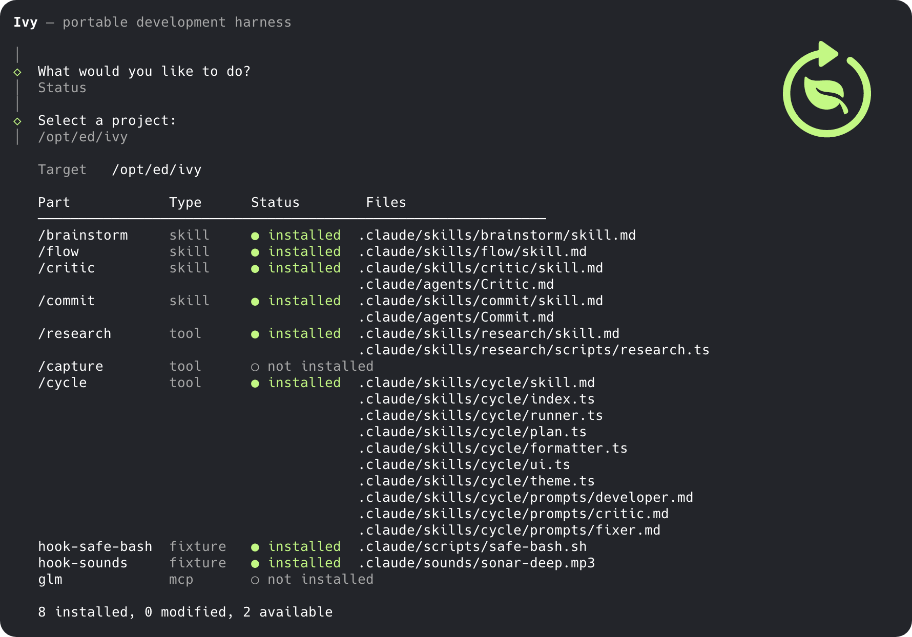

# ♻ Ivy

**Portable development harness compatible with Claude Code.**

- Ivy manages an extendable set of skills, tools, fixtures, MCPs and best practices for fast and practical SDLC with Claude Code.
- Run `bun start` to install Ivy into any project run with Claude Code.
- Update all connected projects by updating Ivy centrally.
- Uninstalls cleanly.



## How it works

Run `bun start`, enter a path to your project and pick which parts to install.  Ivy **symlinks** its `parts` into your project's `.claude/` directory. This means:

- Updating Ivy instantly updates all connected projects
- No copied files to drift out of sync
- Clean uninstallation removes only what Ivy added
- Manifest with SHA-256 hashes detects local modifications

## Parts

Ivy is extendable, and comes with a curated list of parts to start with:

| Part             | Type     | Model  | Description                                                              |
|------------------|----------|--------|--------------------------------------------------------------------------|
| `/brainstorm`    | skill    | opus   | Generates plan files interactively                                       |
| `/cycle`         | tool     | —      | Developer-critic-fixer Ralph loop over brainstormed plans                |
| `/critic`        | skill    | opus   | Launches @Critic and works through findings                              |
| `@Critic`        | agent    | opus   | Sub-agent that reviews uncommitted changes                               |
| `/commit`        | skill    | sonnet | Launches @Commit to commit changes                                       |
| `@Commit`        | agent    | sonnet | Sub-agent that creates structured git commits                            |
| `/research`      | tool     | grok   | Deep web research via Grok AI to replace Googling                        |
| `/flow`          | skill    | sonnet | Explains and visualizes system flows                                     |
| `/capture`       | tool     | —      | Screenshot capture via Playwright                                        |
| `hook-safe-bash` | fixture  | —      | Block destructive bash commands in `--dangerously-skip-permissions` mode |
| `hook-sounds`    | fixture  | —      | Sound notification on Claude session end                                 |
| `glm`            | mcp      | —      | GLM model proxy (z.ai)                                                   |

### Part types

| Type        | Prefix | What it is                                                                        |
|-------------|--------|-----------------------------------------------------------------------------------|
| **agent**   | `@`    | Sub-agent with its own context, tools, and model — invoked as `@name`             |
| **skill**   | `/`    | Prompt template with model directive — invoked as `/name` in Claude Code          |
| **tool**    | `/`    | Skill with supporting scripts or runtime — invoked as `/name`                     |
| **fixture** | —      | Project configuration: hooks, scripts, assets (not a command)                     |
| **mcp**     | —      | MCP server entry injected into `.mcp.json`                                        |

**Agents** runs in its own isolated context window and are used to work where a fresh perspective matters — code review, research, audits.

## Setup

**Prerequisites**: [Bun](https://bun.sh) runtime.

```bash
git clone git@github.com:jdanilov/ivy.git && cd ivy && bun install
```

Then run:

```bash
# Interactive mode — pick command and project
bun start

# Direct commands
bun src/cli.ts install /path/to/project         # Adds / removes / reviews parts
bun src/cli.ts uninstall /path/to/project
bun src/cli.ts status /path/to/project
bun src/cli.ts cycle /path/to/project           # Runs cycle ralph loop
```

## Development workflow

Ivy is built around **code → review → commit** loop:

### Day-to-day coding

- Use `/brainstorm` to plan before starting anything non-trivial — it asks clarifying questions and produces a plan file with tasks and acceptance criteria in `docs/plans/`.
- Use `/critic` before committing or when you've made meaningful changes (a feature, a fix, a refactor).
- Use `/commit` to make structured.

### Autonomous loop with cycle

- For larger tasks, use the full `/cycle` loop instead of coding manually.
- After brainstorming produces a plan, run `bun src/cli.ts cycle dark-mode-support`

Cycle runs autonomously: Developer implements tasks → Critic reviews changes → Fixer addresses findings → Committer creates structured commits. Repeats until all tasks are complete. If the Developer needs input, it adds "Ask User" items to the plan and cycle pauses for your answer.

### Research

- Use `/research <question>` for fact-checked, cited research via Grok AI before making architectural decisions. Results are saved to `docs/research/` for reference.
- Use `/flow <feature>` to explain a data flow for a feature, bug, sub-system.

## Extending Ivy

**Skill** (prompt template):

1. Create `parts/skills/<name>/skill.md` with YAML frontmatter (`name`, `model`, `description`) and your prompt. Use `$ARGUMENTS` for user input.
2. Register in `src/core/registry.ts` with `type: 'skill'`.

**Agent** (isolated sub-agent):

1. Create `parts/agents/<name>.md` with frontmatter (`name`, `description`, `tools`, `model`) and the system prompt.
2. Register in `src/core/registry.ts` with `type: 'agent'`, targeting `.claude/agents/<name>.md`.

Then run `ivy install` on your project to symlink it in.

## Environment variables

Some parts require API keys. Ivy checks both `process.env` and the target project's `.env` file.

| Part        | Variable      | Where to get             |
|-------------|---------------|--------------------------|
| `/research` | `XAI_API_KEY` | https://console.x.ai     |
| `glm`       | `GLM_API_KEY` | https://open.bigmodel.cn |

## License

MIT
